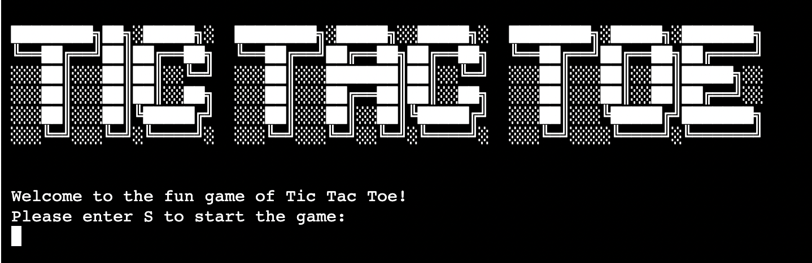
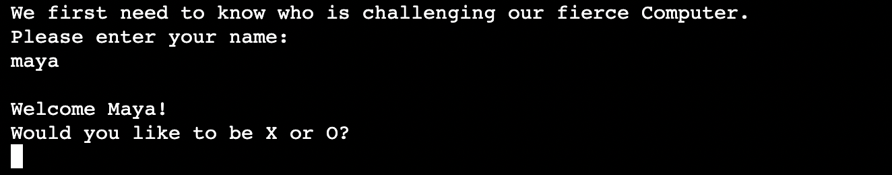
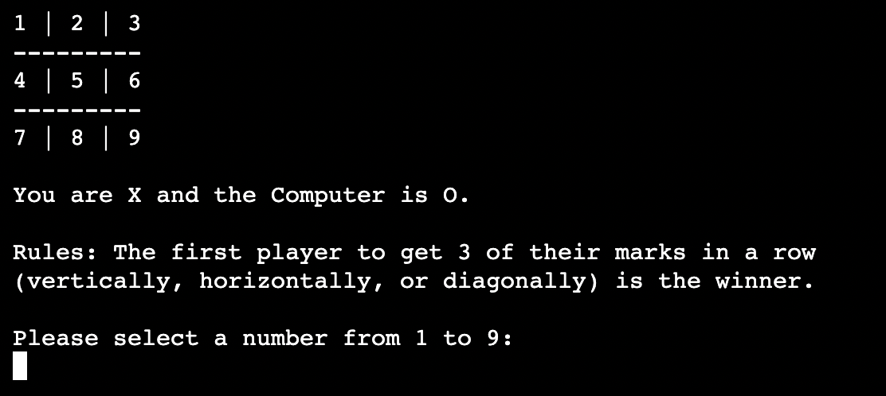
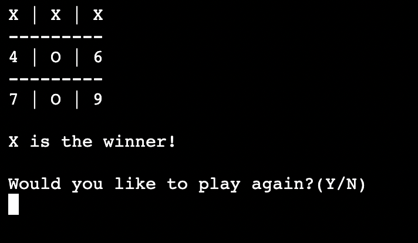
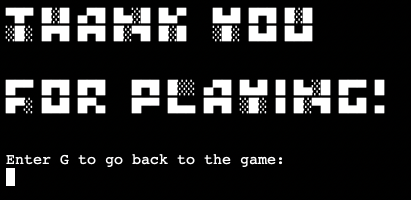

# Tic Tac Toe

## Introduction

Tic Tac Toe is a Python terminal game for some quick fun.
It runs in the Code Institute mock terminal on Heroku.

The user plays against the Computer taking turns marking the spaces in a three-by-three grid with X or O. The player who succeeds in placing three of their marks in a horizontal, vertical, or diagonal row is the winner.

Link to the live site here - [Tic Tac Toe](https://tictactoe1-722b4773e2cf.herokuapp.com/)

## Table of Contents:
1. [**Introduction**](#introduction)
1. [**How to play**](#how-to-play)
1. [**Features**](#Features)
    * [***Existing features***](#existing-features)
    * [***Future features***](#future-features)
1. [**Data model**](#data-model)
1. [**Testing**](#testing)
    * [***Manual testing***](#manual-testing)
    * [***Validator testing***](#validator-testing)
1. [**Deployment**](#deployment)
    * [***Cloning***](#cloning)
1. [**Bugs**](#bugs)
    * [***Fixed Bugs***](#fixed-bugs)
    * [***Unfixed Bugs***](#unfixed-bugs)
1. [**Credits**](#credits)

## How to play

- The user first selects the symbol it wishes to be, "X" or "O". The Computer is then automatically the symbol that wasn't selected.
- The game is played on a grid that's 3 squares by 3 squares.
- Players take turns putting their marks in a square by entering the number labeled on each square.
- When one player has achieved 3 marks in a row vertically, horizontally or diagonally, the game is over and that player has won.
- If all squares are filled up without a winner, we have a tie.

## Features 

### Existing features
- 
    *

- 

- 

- 

- 

### Future features
- Add a timer for the user's turn.
- Add a scoreboard and collect points from each round so you can see how many times you or the computer has lost/won.
- Add more fun design aspects such as colors and emojis.
- Improve the Computer's mark selection based on the game board after each user selection.

## Data model

This project is a functional based application with one global variable, "board".

This variable is passed through the various functions that run the game and it updates its value (replacing the numbers with an "X" or "O") after each user input during the Tic Tac Toe game.

The global variable is then reset at the end of the playthrough by declaring it again with its initial value in the play_game function.

## Testing 

### Manual testing
I manually tested this site in multiple ways highlighted below:
* Passed the code through a PEP8 linter with no errors present.
* Tested the code in [Replit](https://replit.com/~) through the Console output.
* Tested invalid inputs to confirm that the code worked properly with errors.
* Deployed the project in Heroku at an early stage and received feedback from a professional developer (mentor), as well as multiple Python-proficient friends.

### Validator Testing 
- PEP8
  - There were no errors present when passing through the PEP8 CI testor 

## Deployment

To deploy the site to Heroku, I went through below steps: 
- Go to [Heroku](https://heroku.com/) and log into your account.
- Click "Create new app" on the front page.
- Give your app a name (every name has to be unique on Heroku so it's ok if you can't name your project the same as on GitHub).
- Choose your region (USA or Europe) and click "Create app".
- You're then taken to the dashboard of your app where you have a navigation bar. Click on the Settings tab and scroll down to "Config Vars".
- Click "Reveal Config Vars" and input the key as "PORT" and the value as "8000" and press "Add".
- Underneath this section, you have the "Buildpacks" section. Click "Add buildpack" and add the "python" buildpack (make sure to click "save changes" after selecting each buildpack), as well as the "nodejs" buildpack.
- Go back to the navigation bar and select "Deploy".
- Scroll down to the "Connect to GitHub" section and click the connect button.
- After allowing Heroku access to GitHub, the "Connect to GitHub" section will allow you to search for the repository you wish to connect.
- Find your repository and click "Connect".
- You can now choose automatic deploys (Heroku deploys your app after every GitHub push you make) or manual deploys.
- After choosing a deployment method, click the deploy button and make sure you deploy from the correct branch.

Live link to the site - [Tic Tac Toe](https://tictactoe1-722b4773e2cf.herokuapp.com/)

### Cloning

I used the cloning method to use the VSCode desktop IDE with GitHub, below are the steps I took:
- Generate a repository and click the Code button in the middle of the screen.
- Go to Local and under Clone, copy the Git repository URL on the HTTPS tab.
- Go to the VSCode IDE front page and click 'Clone Git Repository' under Start or go to the Source Control button on the left-hand side menu bar and click 'Clone Repository'.
- Input the URL in the URL tab at the top of the window and press Enter.
- Select the location/folder where you want to store your repository on your computer through the popup and click the 'Select Repository location' button.
- VSCode will now clone the repository and you can choose to open it in your current window or in a new window.

## Bugs

### Fixed Bugs
1. **Issue**
    * If user inputs a mark on a spot that is already occupied, the turn jumps to the computer instead of allowing user to input again.
* **Fix**
    * Add "ConnectionRefusedError" and "continue" to else statements in the play_game function.

2. **Issue**
    * If user inputs a number higher than 9 to add a mark to, an error message of "IndexError: list index out of range" pops up.
* **Fix**
    * Add another if/else statement ("if 1 <= choice <= 9") inside the try/except block of the play_game function.

3. **Issue**
    * When user can input "Y/N" to decide to play again, the user could input any letter and it would register as a "N".
* **Fix**
    * Change the if/else statement in the play_again function to a while loop with if/elif/else to target every input.

4. **Issue**
    * Board doesn't reset when deciding to play again, previous game plays continues on to the next round.
* **Fix**
    * Declare the global variable 'board' with its initial value in the play_again function.

### Unfixed Bugs

No unfixed bugs.

## Credits 

- The title art was generated on [FSymbols](https://fsymbols.com/generators/).

- I drew help from various YouTube videos and Python works, all listed below:
[CDcodes](https://www.youtube.com/watch?v=Q6CCdCBVypg&ab_channel=CDcodes)
[Code Coach](https://www.youtube.com/watch?v=dK6gJw4-NCo&ab_channel=CodeCoach)
[Estherns Tic Tac Toe game](https://gist.github.com/Estherns/35929cf33ab7797ead7da6289df2fbac)

There can be similarities in the code but I changed it as much as possible for the purpose of my project.

- I used the code for the clear_console directly from [Delftstack](https://www.delftstack.com/howto/python/python-clear-console/)

- W3Schools and StackOverflow were the sites mostly used for external references.
